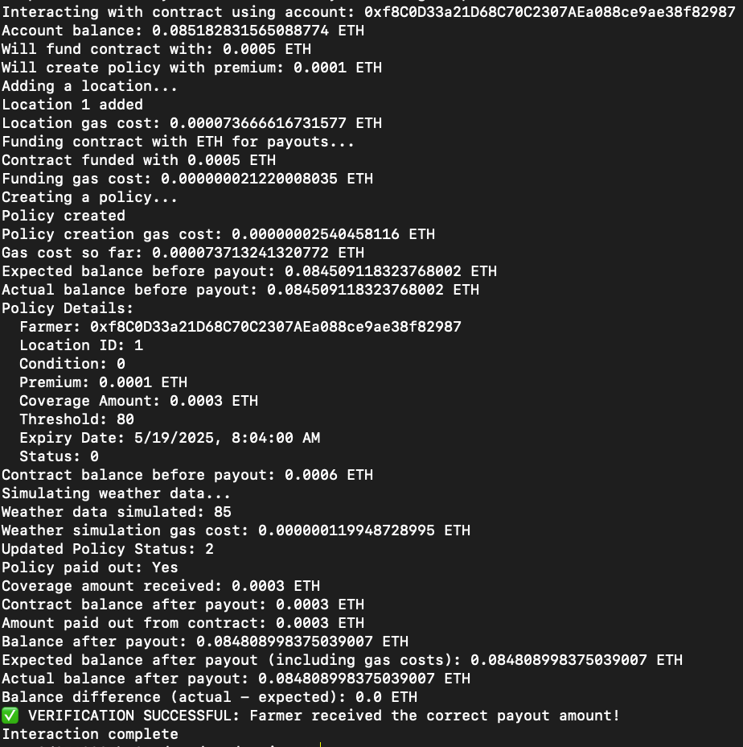

# FITE2010-Project
## Personal project for HKU course FITE2010 - Distributed Ledger and Blockchain
### By Yao Tianle (UID: 3036253691)
-------------------
- Overview:
  This project implements a decentralized insurance system for crop farmers using blockchain technology. Traditional crop insurance often suffers from slow claim processing, ambiguous policy terms, and potential conflicts of interest between insurance providers and farmers. Our smart contract solution addresses these challenges through automation, transparency, and immutable execution.
-------------------
- Problem Statement
  Agricultural producers face significant risks from extreme weather events such as excessive rainfall, drought, and frost. Traditional insurance solutions present several challenges:
  1. Delayed payouts: Manual verification processes can take weeks or months
  2. Policy ambiguity: Terms may be subject to interpretation or dispute
  3. Trust issues: Farmers must rely on insurance companies to honor claims fairly
  4. High administrative costs: Traditional insurance involves significant overhead
-------------------
- Solution
  This smart contract implements an automated, transparent crop insurance platform with the following features:
  1. Instant payouts: Claims are processed automatically when weather thresholds are met
  2. Transparent terms: All policy conditions are explicitly coded in the contract
  3. Trustless execution: Once deployed, the contract executes according to predefined rules without human intervention
  4. Reduced costs: Automation eliminates administrative overhead and reduces premiums
-------------------
- How It Works
  - Policy Creation: Farmers create customized policies by specifying: 
  Location (coordinates);
  Weather condition to insure against (excess rain, drought, or frost);
  Threshold value that triggers a payout;
  Policy duration;
  - Premium Payment: Farmers pay a premium that is proportional to the coverage amount
  - Weather Monitoring: The contract connects to weather data feeds (simulated in this implementation)
  - Automatic Execution: When weather conditions exceed the specified threshold, the contract automatically:
  - Verifies the policy is active
  - Processes the payout to the farmer's wallet
  - Updates the policy status
-------------------
- Technical Implementation
  This project leverages Ethereum smart contracts written in Solidity; and the testing of project runs on Ethereum wallet with testnet ETH (for Sepolia testnet)
-------------------
- Potential Future Enhancements
  - Integration with real-world oracle services like Chainlink for verified weather data
  - Support for parametric insurance with partial payouts based on severity
  - Pooled risk management to optimize capital efficiency
  - Mobile dApp interface for farmers to manage policies
-------------------
### Setup and Deployment
- Install dependencies with command:
  npm install

- Deploy to Sepolia testnet with command:
  npx hardhat run scripts/deploy.js --network sepolia

- Interact with the deployed contract with command:
  npx hardhat run scripts/interact.js --network sepolia
-------------------
### Sample run result:

